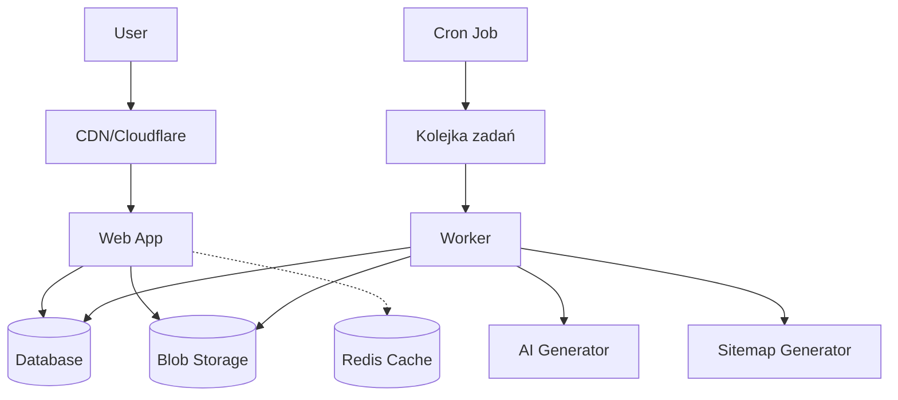
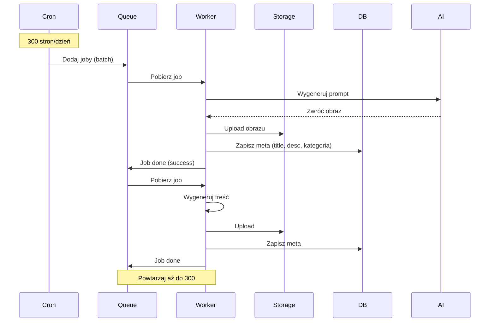
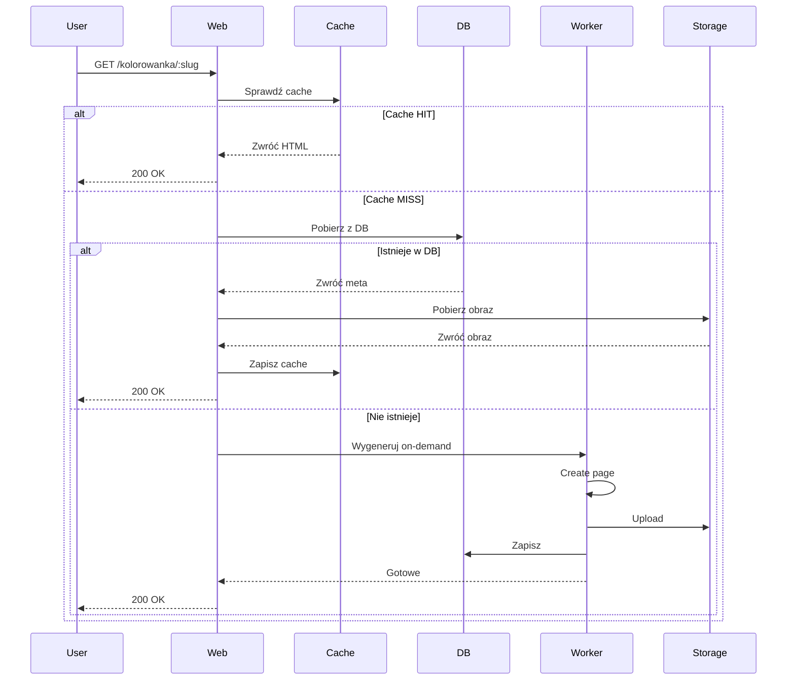
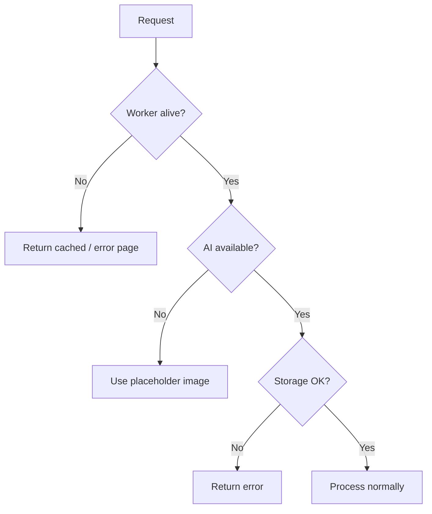
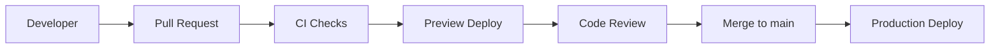

# ARCHITECTURE - Architektura Systemu

> **Data utworzenia:** 2026-02-20  
> **Wersja:** 0.1  
> **Powiązane:** PROJECT_BRIEF.md, docs/SCOPE_MVP.md

---

## 1. Przegląd Systemu

### 1.1 Komponenty

| Komponent | Rola | Technologia |
|-----------|------|-------------|
| **Web** | Serwowanie stron, SSR | Vercel / Cloudflare Pages |
| **Worker** | Generator treści | Node.js / Serverless |
| **Database** | Przechowywanie metadanych | SQLite / PostgreSQL |
| **Queue** | Kolejka zadań | Bull / Redis |
| **Storage** | Przechowywanie obrazów | Vercel Blob / Cloudflare R2 |
| **AI** | Generowanie obrazów | External API (Midjourney/Stable Diffusion) |

---

## 2. Diagram Architektury

---

## 3. Przepływy Danych

### 3.1 Przepływ Dzienny (Cron-driven)

### 3.2 Przepływ Na Żądanie (On-demand)

---

## 4. Punkty Awariei Retry

### 4.1 Strategie Retry

| Komponent | Punkt awarii | Strategia retry |
|-----------|--------------|----------------|
| AI API | API unavailable | Retry 3x, backoff 1s, 2s, 4s |
| Storage | Upload fail | Retry 3x z timeout 30s |
| DB | Connection lost | Auto-reconnect + retry |
| Worker | Crash | Auto-restart + requeue job |
| Queue | Redis disconnect | Auto-reconnect |

### 4.2 Graceful Degradation

---

## 5. Warianty Storage

### 5.1 Porównanie Vercel Blob vs Cloudflare R2

| Funkcja | Vercel Blob | Cloudflare R2 |
|---------|-------------|---------------|
| **Cena (GB/mc)** | $0.15/GB | $0.015/GB |
| **Bandwidth** | Wliczony w plan | $0.01/GB |
| **API** | Vercel SDK | S3-compatible |
| **Limit** | 100GB (free) | 1GB (free) |
| **Wymagany token** | `VERCEL_BLOB_TOKEN` | `R2_ACCESS_KEY`, `R2_SECRET_KEY` |
| **SLA** | 99.9% | 99.9% |

### 5.2 Rekomendacja

| Budżet | Wybór |
|--------|-------|
| $0-50/mc | Cloudflare R2 (tańsze) |
| >$50/mc | Vercel Blob (prostsza integracja) |

---

## 6. Co w Vercel, Co Poza Vercel

### 6.1 W Vercel

| Komponent | Usługa Vercel |
|-----------|---------------|
| Web app | Vercel App |
| SSR | Vercel Functions / Edge |
| Blob storage | Vercel Blob |
| Analytics | Vercel Analytics |
| Deploy | Vercel CI/CD |
| SSL | Vercel (auto) |

### 6.2 Poza Vercel

| Komponent | Opcje |
|-----------|-------|
| Worker (serverless) | Vercel Functions / Railway / Render |
| Queue | Bull + Redis (Railway/Upstash) |
| Database | Vercel Postgres / SQLite (local) |
| AI generation | External API |
| Cron | Vercel Cron / External |

---

## 7. Zmienne Środowiskowe

### 7.1 Wymagane zmienne

| Zmienna | Opis | Przykład |
|---------|------|----------|
| `DATABASE_URL` | Połączenie do DB | `postgresql://...` |
| `REDIS_URL` | Połączenie do Redis | `redis://...` |
| `BLOB_STORAGE_URL` | URL storage | (blob URL) |
| `AI_API_KEY` | Klucz API AI | (zmienna env, nie wartość) |

### 7.2 Uprawnienia tokenów

| Token | Uprawnienia |
|-------|-------------|
| `BLOB_STORAGE_TOKEN` | write, read (brak delete) |
| `AI_API_KEY` | tylko generowanie |
| `DATABASE_USER` | tylko write, read |

---

## 8. Wersjonowanie i Deployment

### 8.1 Środowiska

| Środowisko | Branch | URL |
|------------|--------|-----|
| Development | `develop` | preview URLs |
| Staging | `staging` | staging.example.com |
| Production | `main` | example.com |

### 8.2 Deployment Flow

---

## 9. Monitoring

### 9.1 Metryki

| Metryka | Narzędzie | Cel |
|---------|-----------|-----|
| Uptime | UptimeRobot | >99% |
| Response time | Vercel Analytics | <500ms |
| Error rate | Log analysis | <1% |
| Queue length | Custom dashboard | <100 |

### 9.2 Alerty

| Zdarzenie | Akcja |
|-----------|-------|
| Worker down >5 min | Email alert |
| Queue length >1000 | Slack alert |
| Error rate >5% | Email alert |

---

## 10. Założenia

| Założenie | Opis |
|-----------|------|
| Ruch | <10k visits/miesiąc (MVP) |
| Budżet | $0-50/mc |
| Skalowanie | Dopiero po MVP |
| Worker | Serverless (Vercel Functions) lub VPS |

---

## 11. Historia Zmian

| Data | Wersja | Opis |
|------|--------|------|
| 2026-02-20 | 0.1 | Utworzenie dokumentu |
